# Football Forecaster - Technical Architecture

> [!IMPORTANT]
> This document defines the exact architecture, folder structure, page mapping, component properties, API usage, and agent sequence for the React (CRA) frontend. It must be strictly followed with no deviations or hallucinations.

## 1. Folder Structure (React CRA Validated)

```text
apps/web/src/
  App.js
  index.js
  index.css
  pages/
    ValueBets.js
    Performance.js
    Predictions.js
    PaperBets.js
    HowItWorks.js
  components/
    cards/
      MatchCard.js
      ValueBetCard.js
    tables/
      PredictionsTable.js
      ValueBetsTable.js
    charts/
      EquityCurveChart.js
      MarketRoiChart.js
      MarketAccuracyChart.js
    ui/
      LoadingSpinner.js
      ErrorState.js
      EmptyState.js
      ViewToggle.js
      MarketBadge.js
      EdgeBadge.js
      EVBadge.js
      RefreshButton.js
    layout/
      Layout.js
    navigation/
      Navbar.js
      LeagueSelector.js
  context/
    LeagueContext.js
  lib/
    api.js
    formatters.js
    leagues.js
    types.js
  .env
```

## 2. Page Map & API Usage

| Page Name | Exact Filename | Route | API Endpoint Usage |
|-----------|----------------|-------|--------------------|
| Value Bets (Home)| `ValueBets.js` | `/` | `GET /fixtures/upcoming-with-odds` |
| Performance | `Performance.js` | `/performance` | `GET /paper-bets/summary`, `GET /paper-bets/equity`, `GET /paper-bets/summary-by-market` |
| Predictions | `Predictions.js` | `/predictions` | `GET /predictions/latest` |
| Paper Bets | `PaperBets.js` | `/paper-bets` | `GET /paper-bets/list` |
| How It Works | `HowItWorks.js` | `/how-it-works` | None (Static routing) |

## 3. Component Map & Required Props

### Navigation & Layout
- **`Layout.js`**: `children` (React Node) - Wraps `Navbar` and renders page content
- **`Navbar.js`**: None - Handles links and routing integration
- **`LeagueSelector.js`**: None - Dispatches updates via `LeagueContext`

### UI Elements
- **`LoadingSpinner.js`**: None
- **`ErrorState.js`**: `message` (String), `onRetry` (Function)
- **`EmptyState.js`**: `message` (String)
- **`ViewToggle.js`**: `isDetailedView` (Boolean), `onToggle` (Function)
- **`MarketBadge.js`**: `marketCode` (String) - Translates raw code to display name
- **`EdgeBadge.js`**: `edge` (Number) - Colors green/red based on positive or negative edge
- **`EVBadge.js`**: `ev` (Number) - Follows formatting rules for positive expect value
- **`RefreshButton.js`**: `onRefresh` (Function), `isRefreshing` (Boolean), `lastUpdated` (String)

### Cards
- **`MatchCard.js`**: (Mobile View) `matchId` (Number), `league` (String), `homeTeam` (String), `awayTeam` (String), `kickoffUtc` (String), `odds` (Array), `isDetailedView` (Boolean)
- **`ValueBetCard.js`**: (Mobile View) `matchId` (Number), `market` (String), `homeTeam` (String), `awayTeam` (String), `kickoffUtc` (String), `oddsDecimal` (Number), `modelProbability` (Number), `impliedProbability` (Number), `edge` (Number), `ev` (Number), `isDetailedView` (Boolean)

### Tables
- **`PredictionsTable.js`**: (Desktop View) `predictions` (Array), `isDetailedView` (Boolean)
- **`ValueBetsTable.js`**: (Desktop View) `valueBets` (Array), `isDetailedView` (Boolean)

### Charts
- **`EquityCurveChart.js`**: `data` (Array of { date, equity }) - Uses Recharts LineChart
- **`MarketRoiChart.js`**: `data` (Array of { market, roi }) - Uses Recharts BarChart
- **`MarketAccuracyChart.js`**: `data` (Array of { market, win_rate }) - Uses Recharts BarChart

## 4. Interaction Diagram (Page → Component → API)

```mermaid
graph TD
    %% Routing
    App[App.js / Router] --> VB[ValueBets.js]
    App --> P[Performance.js]
    App --> Pred[Predictions.js]
    App --> PB[PaperBets.js]
    App --> HIW[HowItWorks.js]

    %% Value Bets Hierarchy
    VB -->|GET /fixtures/upcoming-with-odds| API1[API]
    VB --> ViewToggle
    VB --> RefreshButton
    VB --> MatchCard
    VB --> ValueBetsTable

    %% Performance Hierarchy
    P -->|GET /paper-bets/summary| API2[API]
    P -->|GET /paper-bets/equity| API3[API]
    P -->|GET /paper-bets/summary-by-market| API4[API]
    P --> EquityCurveChart
    P --> MarketRoiChart
    P --> MarketAccuracyChart

    %% Predictions Hierarchy
    Pred -->|GET /predictions/latest| API5[API]
    Pred --> ViewToggle
    Pred --> PredictionsTable

    %% Paper Bets Hierarchy
    PB -->|GET /paper-bets/list| API6[API]
    PB --> EdgeBadge
    PB --> EVBadge
    PB --> ErrorState
    PB --> EmptyState
    
    %% How It Works Hierarchy
    HIW --> Layout
```



## 5. Architectural Validations

Every component and layout file MUST adhere to the following validations:

*   **Design Tokens**: Values like `bg-[var(--color-card)]`, `text-[var(--color-text)]`, `p-[var(--spacing-md)]` must be strictly enforced via Tailwind. Do not use raw hex colors or hardcoded paddings.
*   **Component Rules**: No third-party UI libraries (Material UI, Chakra, etc.). Card styling must match `bg-[var(--color-card)] rounded-lg p-[var(--spacing-md)] shadow-sm`.
*   **Anti-Hallucination**:
    *   No assumptions about Next.js (no file-based routing; all routing is `react-router-dom`).
    *   No raw API codes in UI components; everything must format through `lib/formatters.js` or `MarketBadge.js`.
    *   Do not hallucinate lambda responses in the Simple View mode.
    *   Responsive behavior (<768px for tables turning into cards) must be respected.
*   **JSON Schemas**: Handle all documented field name variations (e.g., `expected_value` vs `ev`, `implied_probability` vs `odds_implied_probability`). Format to 2 decimal places and ensure local dates are generated via `en-ZA`.
*   **Charts**: Recharts MUST be wrapped in `<ResponsiveContainer width="100%" height="100%">`.

## 6. Agent Assignment & Workflow 

Agents MUST be dispatched in this exact order to prevent dependency gridlock:

1.  **API Integration Agent**
    *   **Goal**: Initialize all underlying logic and communication. Build `lib/api.js` utilizing Axios. Define local schemas (`lib/types.js`), formatting logic (`lib/formatters.js`), and `context/LeagueContext.js` for app-wide state.
2.  **UI/UX Agent**
    *   **Goal**: Establish visual library. Write `index.css` defining the CSS variables (`--color-primary`, `--color-bg`, etc.). Implement all dumb components nested in `components/ui/`, `components/cards/`, `components/tables/`, and `components/charts/`.
3.  **Frontend Engineer Agent**
    *   **Goal**: App construction and routing. Stitch the built components into the 5 master pages in `src/pages/`. Set up `App.js` routes via `react-router-dom`, intercept page-level API calls, and wire state flows (Data -> Loading/Error/Empty -> Views -> Components). 
4.  **QA Agent**
    *   **Goal**: Final Validation. Verify data schemas, routing functionality, zero TS/JSX errors, responsive behavior of grids/cards, empty state fallbacks, and design token accuracy. Validate output strictly against `CONTEXT_PACKAGE.md`.
